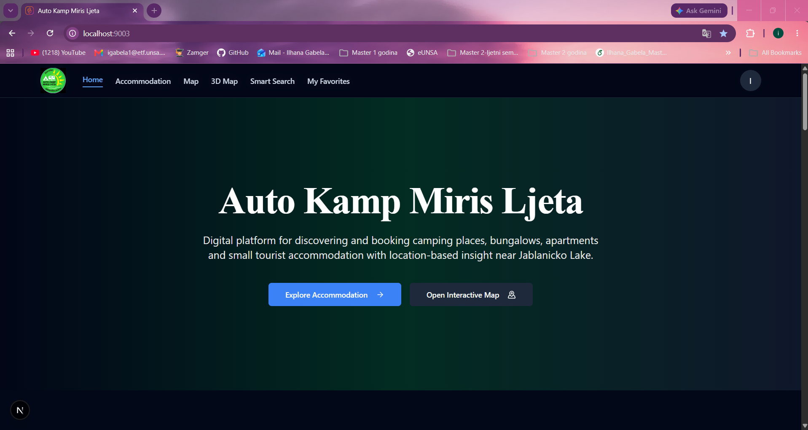
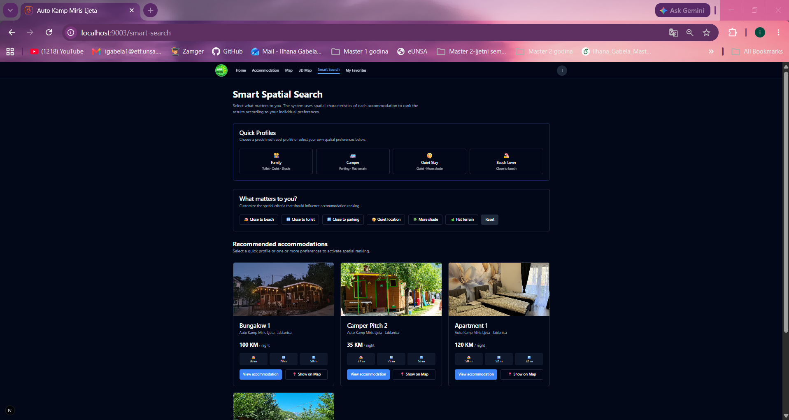
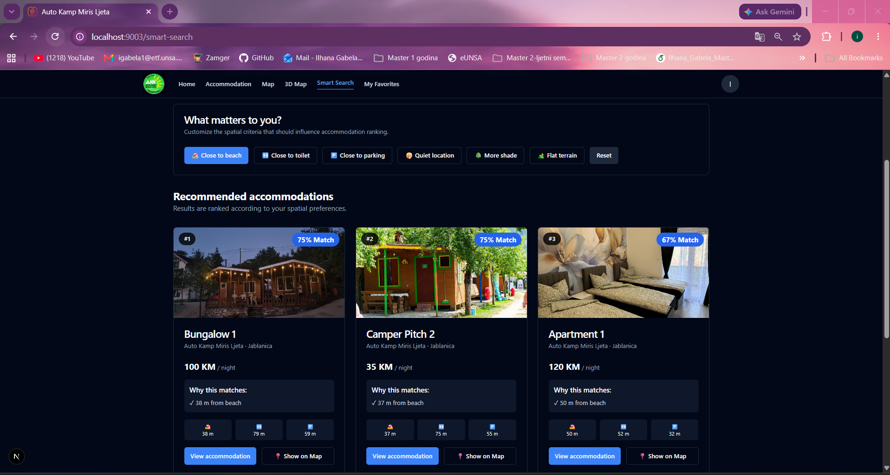
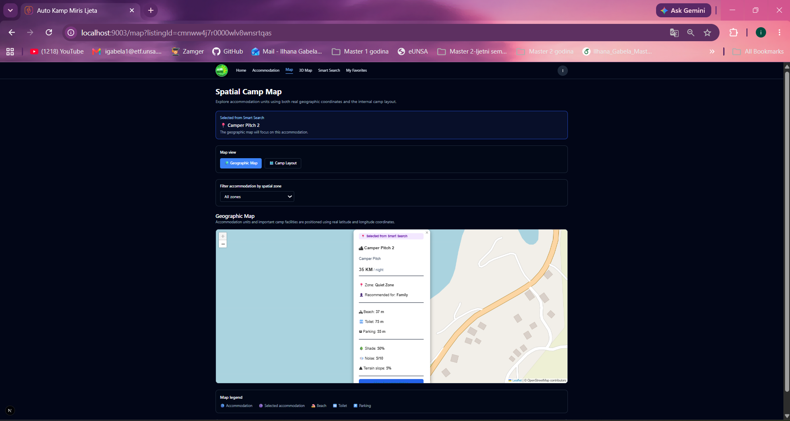
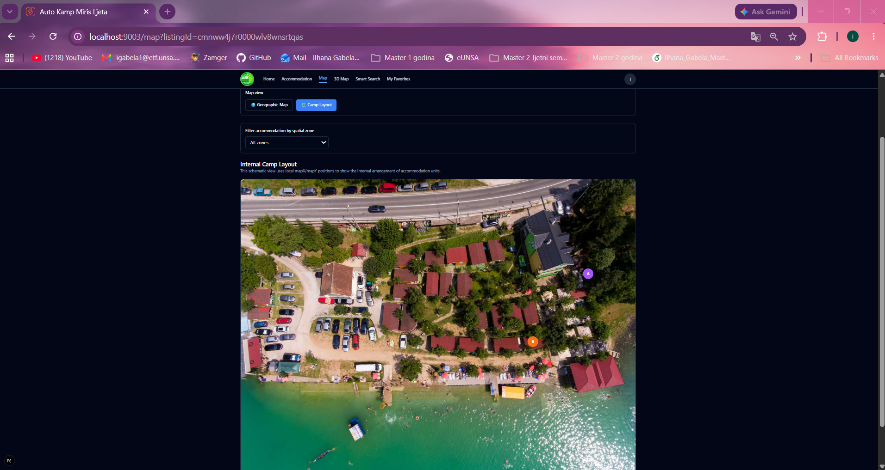

# CampStay – Spatially-Aware Booking Platform

CampStay is a full-stack web application developed as part of my Master's thesis at the Faculty of Electrical Engineering, University of Sarajevo.

The platform is designed for booking campsites and small tourist accommodation while extending traditional booking functionality with spatial and micro-location data.

## Key Features

- User registration and authentication
- Guest, provider and administrator roles
- Accommodation listing management
- Reservation management
- Favorites and guest reviews
- Provider and administrator dashboards
- Interactive maps
- Internal campsite map
- Nearby attractions
- Spatial attributes for accommodation units
- Personalized Smart Search
- Match Score calculation
- "Why this matches" explanations
- "Show on Map" functionality

## Spatial Model

Accommodation units can include spatial and contextual information such as:

- Geographic coordinates (latitude / longitude)
- Position within the campsite
- Distance to beach
- Distance to toilets
- Distance to parking
- Shade level
- Noise level
- Terrain slope
- Spatial zone

These attributes are used by the Smart Search functionality to provide personalized accommodation recommendations.

## Smart Search

Instead of providing the same ranking to every user, CampStay considers individual preferences and calculates a personalized Match Score.

The system also provides a "Why this matches" explanation and allows users to locate recommended accommodation directly on the map.

## Application Screenshots

### Home Page


### Smart Search – Quick Profiles


### Smart Search – Match Results


### Geographic Map


### Internal Camp Map


## Technologies

### Frontend
- Next.js 16
- React
- TypeScript
- Tailwind CSS
- shadcn/ui

### Backend
- Next.js
- Prisma ORM
- PostgreSQL

### Authentication
- NextAuth.js
- bcryptjs

### Maps and Spatial Features
- Leaflet
- React-Leaflet
- Google Maps / Places API
- Cesium

### Database
- PostgreSQL
- Neon

## Getting Started

### 1. Clone the repository

```bash
git clone https://github.com/igabela1/campstay-spatial-booking-platform.git
cd campstay-spatial-booking-platform
```

### 2. Install dependencies

```bash
npm install
```

### 3. Configure environment variables

Copy `.env.example` to `.env` and configure the required database, authentication, and API credentials.

Never commit your real `.env` file or secret keys.

### 4. Set up the database

```bash
npx prisma generate
npx prisma db push
```

### 5. Run the application

```bash
npm run dev
```

Open http://localhost:9003 in your browser.

## Master's Thesis

**Title:** Analysis and Model for Improving Digital Platforms for Booking Camping and Small Tourist Accommodation Using Spatially-Oriented Data

**Institution:** Faculty of Electrical Engineering, University of Sarajevo

**Year:** 2026

## Author

**Ilhana Gabela**  
MSc in Electrical Engineering – Computer Science and Informatics

GitHub: https://github.com/igabela1